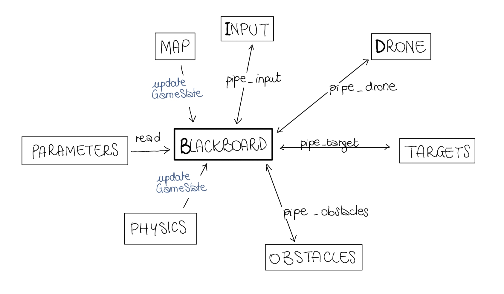

# Assignment 1 – Drone Operation Simulator

This project implements an **interactive multi-process drone simulator** based on a **Blackboard architecture**, where multiple external processes communicate through Unix pipes.

---

## System Architecture

The system follows a **Blackboard architectural** pattern where multiple autonomous processes communicate with a central server (Blackboard):



### Principal Components

| Component | Role | Process | Communication |
|----------|------|---------|----------------|
| **B: Blackboard Server** | - Central game server<br>- Physics updates<br>- Rendering<br>- Message routing | `blackboard` | Pipes + `select()` |
| **I: Input Manager** | - Captures keyboard input<br>- Sends directional commands | `process_input` | `pipe_input → Blackboard` |
| **D: Drone Dynamics** | Sends periodic tick messages (50 Hz) | `process_drone` | `pipe_drone → Blackboard` |
| **T: Target Generator** | Generates random target positions | `process_targets` | `pipe_targets → Blackboard` |
| **O: Obstacle Generator** | Generates random obstacle positions | `process_obstacles` | `pipe_obstacles → Blackboard` |


### Process Flow
1. Initialization: Blackboard spawns all child processes via `fork()` and `execlp()`
2. Setup Phase: Target and obstacle generators send initial configurations
3. Main Loop:
   * Input manager continuously monitors keyboard
   * Drone process sends physics tick messages (20ms intervals)
   * Blackboard processes messages via `select()` multiplexing
   * Physics engine updates drone position and forces
   * Renderer updates ncurses display

---

## Physics Model

The drone motion follows the dynamic equation:
\[ 
   F = M \frac{d^2 p}{dt^2} + K \frac{dp}{dt} 
\]

Where:
- **p** = drone position (x, y)  
- **M** = mass  
- **K** = viscous drag coefficient
- **ΣF** = total force (command + obstacle + fence)

### Forces implemented

1. **Command Force (F<sub>cmd</sub>)**  
   Updated incrementally from input commands (8 directions + brake).
   Key Functions:
    |Key|Action|Description|
    |---|---|---|
    |w or W|Move Up-Left|Diagonal movement|
    |e or E|Move Up|Vertical movement|
    |r or R|Move Up-Right|Diagonal movement|
    |s or S|Move Left|Horizontal movement|
    |d or D|Brake|Reduces velocity <br>and force by 50%|
    |f or F|Move Right|Horizontal movement|
    |x or X|Move Down-Left|Diagonal movement|
    |c or C|Move Down|Vertical movement|
    |v or V|Move Down-Right|Diagonal movement|
    |q or Q|Quit|Shutdown simulator|

2. **Obstacle Repulsion (F<sub>obst</sub>)**  
   Modified Khatib potential field with radial and tangential components:
   $$ 
   F_{\text{rep}} =
   \eta\left(\frac{1}{d} - \frac{1}{\rho}\right)\frac{1}{d^2},
   \qquad d < \rho   $$
   Where
      - **ρ (rho)**: influence radius of obstacles
      - **η (eta)**: radial repulsion gain
      - **d**: distance from obstacle center

   Tangential force creates a smooth “swirling” effect around obstacles.

3. **Fence Repulsion (F<sub>fence</sub>)**  
   Avoids boundary collisions by pushing the drone away from the world limits.

---

## Repository Structure
The project is structured as follows:
```bash
assignment1/
│
├── bin/
│ └── parameters.config
├── build/
│ └── bin/ (compiled executables)
├── img/
│ └── architectures.jpg
├── include/
│ ├── map.h
│ ├── process_drone.h
│ ├── process_input.h
│ ├── world.h
│ └── world_physics.h
├── src/
│ ├── blackboard.c
│ ├── map.c
│ ├── process_drone.c
│ ├── process_input.c
│ ├── process_obstacles.c
│ ├── process_targets.c
│ ├── world.c
│ └── world_physics.c
├── Makefile
└── README.md
```

---

## Build & Run

### Prerequisites
- `gcc`
- `make`
- `ncurses` library
- `konsole` (used to spawn subprocesses automatically)

### Clone the repository
```bash
gh repo clone Chiaera/AdvancedRobotProgramming
```

### Launch
The `MakeFile` is responsable for removing the previous builds and compile all the files, so you can directly run the program.
```bash
#from the assignment1 directory
cd ~/AdvancedRobotProgramming/assignment1
make run
```