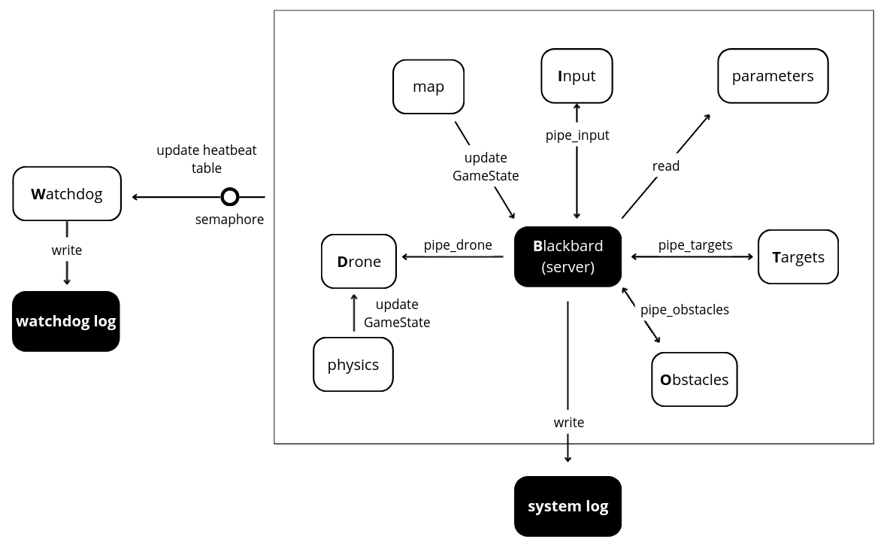
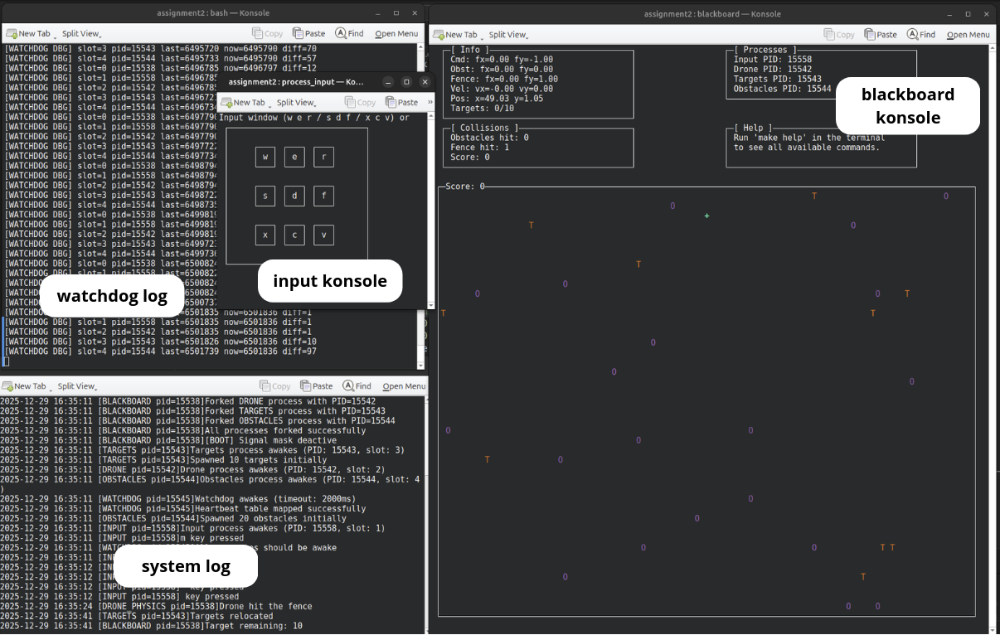
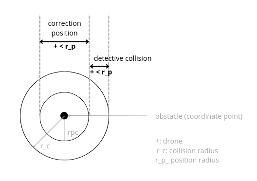
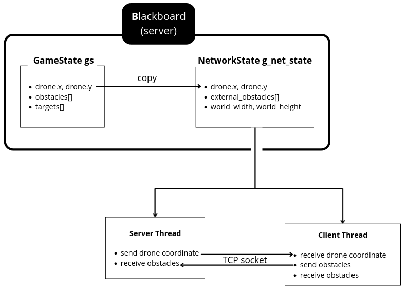

# Assignment 3

This project implements an **interactive multi‑process drone simulator** based on a **Blackboard architecture**. 
Multiple autonomous processes communicate asynchronously with a central server using POSIX pipes, while a watchdog monitors the system through shared memory and semaphores. The project implemented a `protocol` to allow the interaction with other projects. 

---
## System Architecture
<div align="center">
  
</div>


### Components details

The system implements **6 active processes**, coordinated through a central server (Blackboard):
| # | Component | Role | Communication |
|---|-----------|-------|---------------|
| 1 | **Blackboard Server** | - Central game server<br>- physics engine<br>- rendering | Pipes + `select()` |
| 2 | **Input Manager** | - Captures keyboard input<br>- Sends directional commands | `pipe_input` |
| 3 | **Drone Process** | Sends periodic tick messages (50 Hz) | `pipe_drone` |
| 4 | **Target Generator** | Random target spawner | `pipe_targets` |
| 5 | **Obstacles Generator** | Generates random obstacle positions | `pipe_obstacles` |
| 6 | **Watchdog** | System monitor | Shared memory + signals |

<br>

1. #### Blackboard server
   The Blackboard is the global server, it runs a continuous loop driven by:
   - `read()` the parameters file
   - update functions: apply received data into `GameState`
   - update the physics by calling `drone_physics()`
   - ncurses: refreshes the visual interface
   - monitors all pipes simultaneously with `select()`
   
   It ensures coordination without requiring components to communicate directly with each other.
     
<br>

2. #### Input manager
   It is responsible for update the *command forces* stored in `GameState`:
   - get input from keyboard
   - convert the input into a control force message

<br>

3. #### Drone process
   It acts as the global **timekeeper**:
   - uses `nanosleep()` to trigger a tick every 20 ms (50 Hz) for update the **physics engine**
   - sends a **DRONE_TICK** message via write(`pipe_drone`)

<br>

4. #### Target Generator
   It is used to spawn the target every 30 seconds
   - use `rand()` to compute new valid positions
   - send updates asynchronously using their respective pipes

<br>

5. #### Obstacles Generator
   Similar to the **Target process**, it is used to spawn the obstacles every 30 seconds
   - use `rand()` to compute new valid positions
   - send updates asynchronously using their respective pipes

<br>

6. #### Watchdog
   It is the safety component that monitors system health
   - **Monitoring Mechanism:**
     - uses POSIX shared memory (`heartbeat`) with a heartbeat table
     - each process updates its slot every 20ms with a monotonic timestamp
     - semaphore protection ensures thread-safe access to the heartbeat table
    - **Timeout Detection:**
      - checks all processes every 10ms
      - if any process stops updating its heartbeat, the watchdog calls the TIMEOUT (2000ms)
     
    - **Shutdown Procedure:**
      - detects unresponsive process or window closure (SIGHUP)
      - sends `SIGUSR1` to Blackboard: triggers `endwin()` for clean ncurses shutdown
      - waits 200ms for the cleanup
      - sends `SIGKILL` to all registered processes
      - unmaps shared memory and exits
      
   - **Monitored Events:**
      - Process crashes or deadlocks
      - Terminal window closure
      - Blackboard termination
      
     This ensures the system never leaves zombie processes or corrupted terminal states.

<br>
  
Instead, the **shared component** are
  - #### GameState file
      It is a central shared structure, contained in `world` file where all the variables are contained. All processes can read the values by the header.

  - #### Map loader
    `map` is responsible for update the parameters and load the world map.
  - #### Shared Heartbeat Memory
    It is impliemented by `heartbeat` process and consider a safety control with the use of a semaphore.


---
## Execution Flow

1. ### Initialization
   At startup, the Blackboard:
   - creates `pipe()`
   - spawns child processes (`fork()` + `execlp()`)
   - initializes the `GameState`
   - loads parameters from `parameters.config`
   - loads the map through the Map Loader
  
   All processes are now active and ready to send messages.

<br>

2. ### Runtime Message Flow
   #### Input → Blackboard
   - non‑blocking ncurses loop (`nodelay()`, `getch()`)
   - keypress → control force
   - updates `fx_cmd` and `fy_cmd` in `GameState`

   #### Drone → Blackboard
   - sends a **DRONE_TICK** every 20 ms (`nanosleep()`)
   - triggers the physics update
   
   #### Targets / Obstacles → Blackboard
   - generate new positions using `rand()`
   - send asynchronous updates through their pipes
   - Blackboard merges updates into `GameState`

<br>

3. ### Blackboard Main Loop
   The Blackboard runs a continuous loop:
   - monitors all pipes with `select()`
   - reads available messages (non‑blocking)
   - updates the `GameState`
   - calls `drone_physics()` on each tick
   - refreshes the ncurses interface
   
   This loop acts as the **central coordinator** of the system.

<br>

4. ### Physics Step
   Triggered by the drone tick:
   - reads current position and velocity
   - computes all forces:
     - command force  
     - obstacle repulsion  
     - fence repulsion
   - applies sub‑stepping integration to avoid tunneling
   - updates the drone state in `GameState`

<br>

5. ### Rendering
   - draws the map
   - draws drone, targets, obstacles
   - updates HUD (forces, velocity, position)

<div align="center">
  
</div>

<br>

---
## Physics Model

The drone motion follows the dynamic equation:

$$F = M \frac{d^2 p}{dt^2} + K \frac{dp}{dt}$$

Where:
- **p** = drone position (x, y)  
- **M** = mass  
- **K** = drag coefficient
- **ΣF** = resultant force

<br>

### Forces implemented

1. **Command Force (F<sub>cmd</sub>)**  
   Updated incrementally from input commands (8 directions + brake).<br>
   **Key Functions:**
    |Key|Action|Description|
    |---|---|---|
    |w or W|Move Up-Left|Diagonal movement|
    |e or E|Move Up|Vertical movement|
    |r or R|Move Up-Right|Diagonal movement|
    |s or S|Move Left|Horizontal movement|
    |d or D|Brake|Reduces velocity <br>and force by 50%|
    |f or F|Move Right|Horizontal movement|
    |x or X|Move Down-Left|Diagonal movement|
    |c or C|Move Down|Vertical movement|
    |v or V|Move Down-Right|Diagonal movement|
    |q or Q|Quit|Shutdown simulator|

2. **Obstacle Repulsion (F<sub>obst</sub>)**  
   Modified Khatib potential field with radial and tangential components:
   
   $$F_{\text{rep}} = \eta\left(\frac{1}{d} - \frac{1}{\rho}\right)\frac{1}{d^2},  \qquad d < \rho$$
   
   Where
      - **ρ (rho)**: influence radius of obstacles
      - **η (eta)**: radial repulsion gain
      - **d**: distance from obstacle center

   Tangential force creates a smooth “swirling” effect around obstacles.

4. **Fence Repulsion (F<sub>fence</sub>)**  
   Avoids boundary collisions by pushing the drone away from the world limits.

<br>

### Collision handling
<div align="center">
  
</div>

<br>

The `obstacles_hit` considers a a circle around the obstacles `r_collision`. It also considers a nearer area around the obstacles of `r_position` which is responsible for correcting the drone position to avoid the overlap beetween the drone and the obstacle itself. To avoid this overlapping it also implemented a *sub-stepping* method.

<br>

### Score System
The scoring system rewards the player for collecting targets and applies penalties for collisions:

- **+10 points** for each collected target  
- **–3 points** for each fence collision  
- **–5 points** for each obstacle collision  

The final score is updated in real time and displayed in the HUD.

<br>

---
## Protocol
The client-server protocol is a sequential handshake followed by a cyclic exchange of information between two drone simulators through 4 steps:

1. ### Handshake
   This step ensures that both simulators are alive and speaking the same protocol.
   ```
   SERVER → CLIENT: "ok"
   CLIENT → SERVER: "ook"
   ```
   The connection continues only if the client replies correctly.
   
2. ### Exchange information about the world size
   The server communicates its world dimensions so the client can verify compatibility.
   ```
   SERVER → CLIENT: "size width height"       
   CLIENT → SERVER: "sok wxh"     
   ```
   The server checks only that the reply begins with `"sok"`.

3. ### Main infinite loop
   The server and client enter a sequential, blocking loop. Each iteration consists of two phases. <br>
   First the server sends its drone position; the client acknowledges.
   ```
   SERVER → CLIENT: "drone"
   SERVER → CLIENT: "drone_x drone_y"            
   CLIENT → SERVER: "dok drone"   
   ```
   Then the server requests one obstacle at a time. <br>
   The client responds by sending **its own drone position**, which the server stores as an *external obstacle*.
   ```
   SERVER → CLIENT: "obst"
   CLIENT → SERVER: "ostacolo_x ostacolo_y"             
   SERVER → CLIENT: "pok obstacle_i"  
   ```
   Each response corresponds to one external obstacle slot in the server’s `NetworkState`.

5. ### Quit
   The loop ends when the server decides to stop the exchange.
   ```
   SERVER → CLIENT: "q"                  
   CLIENT → SERVER: "qok" 
   ```
   <br>
   
The protocol is implemented as **thread** so it can access directly to the `GameState` structure and both the **server thread** and **client thread** access the shared `NetworkState` structure.

<div align="center">
  
</div>

To prevent race conditions with the Blackboard (which also reads/writes the same data), all accesses are protected using the principle of the mutual exclusion `MUTEX`:
```
pthread_mutex_lock(&g_net_mutex);
/* read/write shared state */
pthread_mutex_unlock(&g_net_mutex);
```
This ensures consistent updates of drone positions and external obstacles. <br>

### Set protocol parameter
It is possible running the simulator as four different mode: **server**, **client**, **peer-to-peer** and **offline**.
The mode is selected through the network section of  `parameters.config`.

Before it is necessary know the *IP address* of the device that will be used as **server**, open the terminal and run:
``` 
   ip addr show | grep "inet "

   #example:
   #   inet 127.0.0.1/8 scope host lo
   #   inet 192.168.1.23/24 brd 192.168.1.255 scope global dynamic noprefixroute wlp0s20f3
```
Then modify the following values of `parameters.config` with the desired parameters:
* NETWORK_ENABLED: enables (=1) or disables (=0) network mode
* NETWORK_PORT: port on which the server listens(e.g., =8888)
* NETWORK_CLIENT_TARGET: IP and port of the server to which the client connects (e.g., =192.168.1.23:8888)

Referring to the IP in the example, the **drone simulation** can be run as:
|Mode |NETWORK_ENABLED |NETWORK_PORT |NETWORK_CLIENT_TARGET |
|------------ |------------ |------------ |------------ |
|server |1 |8888 |*(empty)* | 
|client |1 |8888 |192.168.1.23:8888 | 
|peer-to-peer |1 |8888 |192.168.1.23:8888 *( * )* | 
|offline |0 |- |*(empty)* | 

(*) *In peer‑to‑peer mode, the simulator starts both the server thread and the client thread, allowing symmetric communication.*
<br>

---

## Project Structure
The project is structured as follows:
```bash
assignment3 
      ├── bin
      │   └── parameters.config
      ├── img
      │   ├── architecture.png
      │   ├── collision.png
      │   ├── protocol.png
      │   └── screenshot.png
      ├── include
      │   ├── drone_physics.h
      │   ├── heartbeat.h
      │   ├── logger.h
      │   ├── map.h
      │   ├── network.h
      │   ├── process_drone.h
      │   ├── process_input.h
      │   └── world.h
      ├── Makefile
      ├── README.md
      └── src
          ├── blackboard.c
          ├── drone_physics.c
          ├── map.c
          ├── network.c
          ├── process_drone.c
          ├── process_input.c
          ├── process_obstacles.c
          ├── process_targets.c
          ├── watchdog.c
          └── world.c
```

<br>

---

## Build & Run

### Prerequisites
- `gcc`
- `make`
- `ncurses` library
- `konsole` (used to spawn subprocesses automatically)

If they are not installed you can run this code
```
sudo apt install gcc
sudo apt-get install libncurses5-dev libncursesw5-dev
sudo apt install konsole
```

### Clone the repository
```bash
gh repo clone Chiaera/AdvancedRobotProgramming
```

### Build
The `MakeFile` is responsible for removing the previous builds and compile all the files, so you can directly run the program.
```bash
#from the assignment directory
cd ~/AdvancedRobotProgramming/assignment3
make run-clean #this line is responsible to open the blackboard and input konsole
make tail-logs #this line is responsible to open the log files
```
<br>

## Troubleshooting
### Issue: "konsole: command not found"
If you don't have konsole installed, use:
```bash
make all
./build/bin/blackboard
# In another terminal:
# Input window will open automatically
```

### Issue: "Cannot open parameters.config"
Make sure you're running from the assignment3 directory:
```bash
pwd  # should end with /assignment3
```

### Issue: Watchdog kills processes immediately
Check system clock synchronization if running in a VM.
